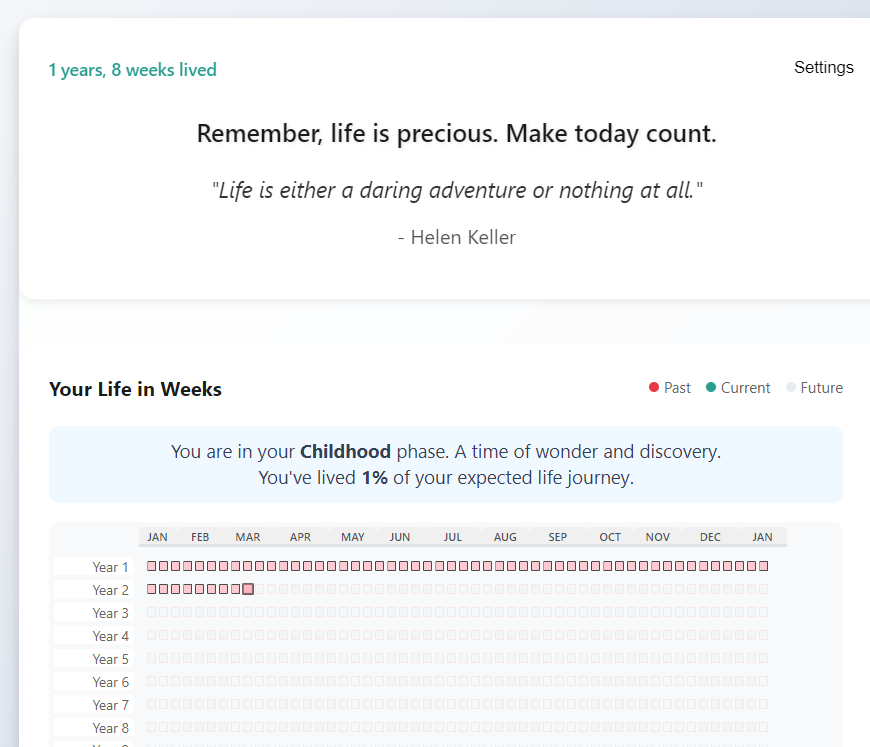
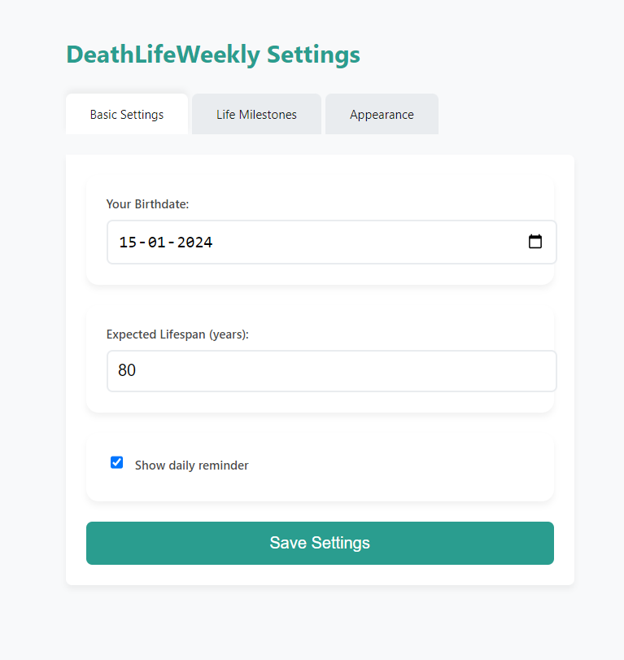

# DeathLifeWeekly

DeathLifeWeekly is a Chrome extension that serves as a life reminder and calendar visualization tool. It leverages modern web technologies including Vite, React, TypeScript, Tailwind CSS, and Lucide React for icons.

## Features
- **Life Reminder & Calendar:** Visualize your life in weeks and receive motivational quotes.
  
- **Customizable Settings:** Configure your birthdate, expected lifespan, theme, phase colors, and add personal milestones.
  
- **Responsive UI:** Includes smooth tab navigation, zoom functionality, and tooltip details.
- **Chrome Extension:** Utilizes a background service worker with options and popup pages.

## Getting Started

### For End Users
1. **Download Extension:**  
   Download the zip file for DeathLifeWeekly.
2. **Extract Files:**  
   Extract the downloaded zip file to your preferred location.
3. **Load the Extension in Chrome:**  
   - Open Chrome and navigate to `chrome://extensions/`
   - Enable **Developer mode** by toggling the switch at the top right.
   - Click on the **Load unpacked** button.
   - Select the folder where you extracted the extension files.

### For Developers
1. **Clone the Repository:**
   ```bash
   git clone <repository-url>
   cd DeathLifeWeekly
   ```
2. **Install Dependencies:**
   ```bash
   npm install
   ```
   or
   ```bash
   yarn install
   ```
3. **Run Development Server:**
   ```bash
   npm run dev
   ```
   or
   ```bash
   yarn dev
   ```
4. **Build for Production:**
   ```bash
   npm run build
   ```
   or
   ```bash
   yarn build
   ```

## File Structure
- **src/**: React application files including main entry point, components, and styles.
- **public/**: Static assets if any.
- **manifest.json, background.js, popup.html, popup.js**: Chrome extension files.
- **options.html, options.js**: Configuration page for extension settings.
- **styles.css**: Styles for the extension popup.
- **eslint.config.js, tsconfig*.json, vite.config.ts**: Project configuration files.

## Development Notes
- The project uses Vite as the build tool for a fast development experience.
- ESLint is configured to ensure code quality.
- Tailwind CSS and custom CSS (in styles.css) are used for styling.
- The extension's settings and milestones are stored using Chrome's storage API.

## License
This project is open source and available under the [MIT License](LICENSE).

---

Happy coding!
